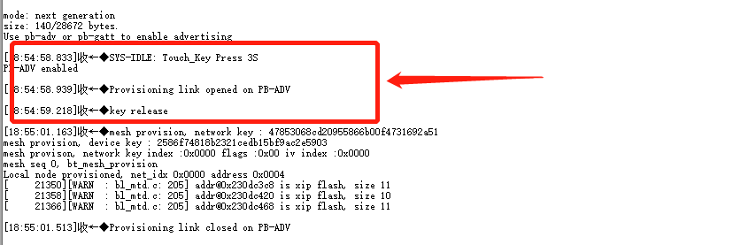
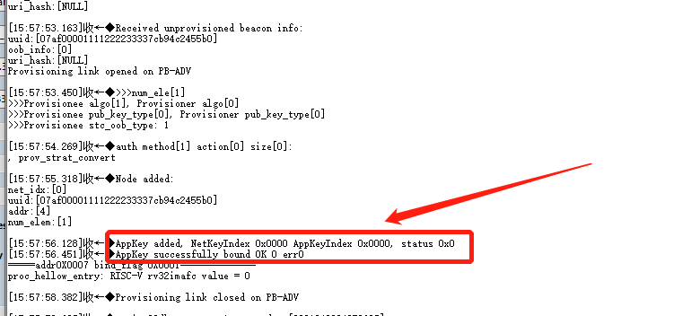
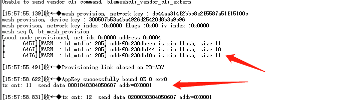

# ble mesh Example
this Example usb one provisioner and two node,different device usb different firmware.

## how to build project
provisoner need to modify:
```c
CONFIG_BT_MESH_PROVISIONER=1；
uint16_t addr = 0X0003;
```

one node need to modify:
```c
CONFIG_BT_MESH_PROVISIONER=0；
uint16_t addr = 0X0003;
```

other node need to modify:
```c
CONFIG_BT_MESH_PROVISIONER=0；
uint16_t addr = 0X0004;
```
 run ./build_project to build project and run ./make_flash to download 

## how to usb

After download the firmware, if the two devices want to start network configuration, each device should be reset by RST first, then the provisioner and node will press and hold the boot button for 3 seconds to automatically enter the network distribution mode; when paired in pairs,  configure node addr 0X0003 first, then configure addr 0X0004;


Press the button for 3 seconds, release the button, the corresponding log information is as shown in the figure:


The log of Provisoner's successful distribution network is shown in the figure:
 

The log of successful Node network configuration is shown in the figure:
 

After the network distribution is successful,
Provisoner presses the boot button, and it will send data to the node whose addr is 0x0003.
Provisoner presses the boot button twice, and it will send data to the node whose addr is 0x0004;
Node presses the boot button to send data to the provisioner,
After the network distribution is successful, the device does not need to be reconfigured and can be used directly after restarting or powering on again;

## Troubleshooting

For any technical queries, please open an [issue](https://github.com/Ai-Thinker-Open/Ai-Thinker-WB2/issues) on GitHub. We will get back to you soon.