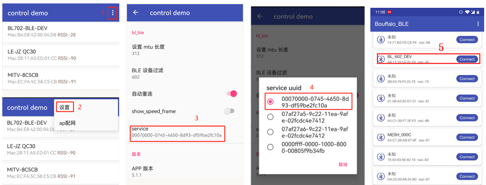
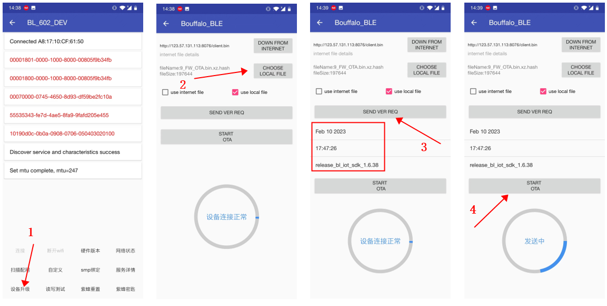

# BLE OTA Example
This is a routine that uses the BLE protocol to perform OTA for Ai-WB2, which can realize the remote firmware upgrade of mobile phones.
## Test step
### 1.Compile and download
`-j8` is the core number of Linux

```shell
make -j8 flash
```
After the download is successful, press the reset key to run.
> **log:**
...other`
tosdac_i=38,tosdac_q=40,tx_iq_gain_comp=966,tx_iq_phase_comp=-11
[BL] [SEC] TRNG Handler
[BL] [SEC] TRNG Handler
[BL] [SEC] TRNG Handler
[BL] [SEC] TRNG Handler
[BL] [SEC] TRNG Handler
BD_ADDR:(MSB)a8:17:10:cf:61:50(LSB) 
[BL] [SEC] TRNG Handler
### 2.Install OTA software and set


### 3. OTA file production
Executing the burn command will generate OTA files. At this time, the hardware Ai-WB2 device should not be connected:
```
[14:34:49.823] - ========= sp image create =========
[14:34:49.825] - Image hash is b'4170e5a52d3f99e564f343cd759f68e80c3c5846bc9f724ea33a6140c63553c1'
[14:34:49.825] - Header crc: b'76478801'
[14:34:49.825] - Write flash img
[14:34:49.827] - FW Header is 176, 3920 still needed
[14:34:49.827] - FW OTA bin header is Done. Len is 4096
[14:34:49.884] - FW OTA bin is Done. Len is 365552
[14:34:50.008] - FW OTA xz is Done
```
The OTA file path is as follows:`tools/flash_tool/chips/bl602/ota`，Recommended use: `FW_ OTA.bin.xz.ash`

### 4.App OTA step


### Upgrade progress log
```
left_size (0x08d0) wData.index (0x0816) len (230) progress:1%
left_size (0x00ba) wData.index (0x002c) len (230) progress:2%
left_size (0x098a) wData.index (0x075c) len (230) progress:3%
left_size (0x0174) wData.index (0x0f72) len (230) progress:4%
left_size (0x0a44) wData.index (0x06a2) len (230) progress:5%
left_size (0x022e) wData.index (0x0eb8) len (230) progress:6%
left_size (0x0a18) wData.index (0x06ce) len (230) progress:7%
left_size (0x02e8) wData.index (0x0dfe) len (230) progress:8%
left_size (0x0ad2) wData.index (0x0614) len (230) progress:9%
left_size (0x03a2) wData.index (0x0d44) len (230) progress:10%
left_size (0x0b8c) wData.index (0x055a) len (230) progress:11%
left_size (0x0376) wData.index (0x0d70) len (230) progress:12%
left_size (0x0c46) wData.index (0x04a0) len (230) progress:13%
left_size (0x0430) wData.index (0x0cb6) len (230) progress:14%
left_size (0x0d00) wData.index (0x03e6) len (230) progress:15%
left_size (0x04ea) wData.index (0x0bfc) len (230) progress:16%
left_size (0x0cd4) wData.index (0x0412) len (230) progress:17%
left_size (0x05a4) wData.index (0x0b42) len (230) progress:18%
left_size (0x0d8e) wData.index (0x0358) len (230) progress:19%
left_size (0x065e) wData.index (0x0a88) len (230) progress:20%
left_size (0x0e48) wData.index (0x029e) len (230) progress:21%
left_size (0x0632) wData.index (0x0ab4) len (230) progress:22%
left_size (0x0f02) wData.index (0x01e4) len (230) progress:23%
left_size (0x06ec) wData.index (0x09fa) len (230) progress:24%
left_size (0x0fbc) wData.index (0x012a) len (230) progress:25%
left_size (0x07a6) wData.index (0x0940) len (230) progress:26%
left_size (0x0f90) wData.index (0x0156) len (230) progress:27%
left_size (0x0860) wData.index (0x0886) len (230) progress:28%
left_size (0x004a) wData.index (0x009c) len (230) progress:29%
left_size (0x091a) wData.index (0x07cc) len (230) progress:30%
left_size (0x0104) wData.index (0x0fe2) len (230) progress:31%
left_size (0x09d4) wData.index (0x0712) len (230) progress:32%
left_size (0x01be) wData.index (0x0f28) len (230) progress:33%
left_size (0x09a8) wData.index (0x073e) len (230) progress:34%
left_size (0x0278) wData.index (0x0e6e) len (230) progress:35%
left_size (0x0a62) wData.index (0x0684) len (230) progress:36%
left_size (0x0332) wData.index (0x0db4) len (230) progress:37%
left_size (0x0b1c) wData.index (0x05ca) len (230) progress:38%
left_size (0x0306) wData.index (0x0de0) len (230) progress:39%
left_size (0x0bd6) wData.index (0x0510) len (230) progress:40%
left_size (0x03c0) wData.index (0x0d26) len (230) progress:41%
left_size (0x0c90) wData.index (0x0456) len (230) progress:42%
left_size (0x047a) wData.index (0x0c6c) len (230) progress:43%
left_size (0x0c64) wData.index (0x0482) len (230) progress:44%
left_size (0x0534) wData.index (0x0bb2) len (230) progress:45%
left_size (0x0d1e) wData.index (0x03c8) len (230) progress:46%
left_size (0x05ee) wData.index (0x0af8) len (230) progress:47%
left_size (0x0dd8) wData.index (0x030e) len (230) progress:48%
left_size (0x05c2) wData.index (0x0b24) len (230) progress:49%
left_size (0x0e92) wData.index (0x0254) len (230) progress:50%
left_size (0x067c) wData.index (0x0a6a) len (230) progress:51%
left_size (0x0f4c) wData.index (0x019a) len (230) progress:52%
left_size (0x0736) wData.index (0x09b0) len (230) progress:53%
left_size (0x0f20) wData.index (0x01c6) len (230) progress:54%
left_size (0x07f0) wData.index (0x08f6) len (230) progress:55%
left_size (0x0fda) wData.index (0x010c) len (230) progress:56%
left_size (0x08aa) wData.index (0x083c) len (230) progress:57%
left_size (0x0094) wData.index (0x0052) len (230) progress:58%
left_size (0x0964) wData.index (0x0782) len (230) progress:59%
left_size (0x014e) wData.index (0x0f98) len (230) progress:60%
left_size (0x0938) wData.index (0x07ae) len (230) progress:61%
left_size (0x0208) wData.index (0x0ede) len (230) progress:62%
left_size (0x09f2) wData.index (0x06f4) len (230) progress:63%
left_size (0x02c2) wData.index (0x0e24) len (230) progress:64%
left_size (0x0aac) wData.index (0x063a) len (230) progress:65%
left_size (0x0296) wData.index (0x0e50) len (230) progress:66%
left_size (0x0b66) wData.index (0x0580) len (230) progress:67%
left_size (0x0350) wData.index (0x0d96) len (230) progress:68%
left_size (0x0c20) wData.index (0x04c6) len (230) progress:69%
left_size (0x040a) wData.index (0x0cdc) len (230) progress:70%
left_size (0x0bf4) wData.index (0x04f2) len (230) progress:71%
left_size (0x04c4) wData.index (0x0c22) len (230) progress:72%
left_size (0x0cae) wData.index (0x0438) len (230) progress:73%
left_size (0x057e) wData.index (0x0b68) len (230) progress:74%
left_size (0x0d68) wData.index (0x037e) len (230) progress:75%
left_size (0x0552) wData.index (0x0b94) len (230) progress:76%
left_size (0x0e22) wData.index (0x02c4) len (230) progress:77%
left_size (0x060c) wData.index (0x0ada) len (230) progress:78%
left_size (0x0edc) wData.index (0x020a) len (230) progress:79%
left_size (0x06c6) wData.index (0x0a20) len (230) progress:80%
left_size (0x0eb0) wData.index (0x0236) len (230) progress:81%
left_size (0x0780) wData.index (0x0966) len (230) progress:82%
left_size (0x0f6a) wData.index (0x017c) len (230) progress:83%
left_size (0x083a) wData.index (0x08ac) len (230) progress:84%
left_size (0x0024) wData.index (0x00c2) len (230) progress:85%
left_size (0x080e) wData.index (0x08d8) len (230) progress:86%
left_size (0x00de) wData.index (0x0008) len (230) progress:87%
left_size (0x08c8) wData.index (0x081e) len (230) progress:88%
left_size (0x0198) wData.index (0x0f4e) len (230) progress:89%
left_size (0x0982) wData.index (0x0764) len (230) progress:90%
left_size (0x0252) wData.index (0x0e94) len (230) progress:91%
left_size (0x0a3c) wData.index (0x06aa) len (230) progress:92%
left_size (0x0226) wData.index (0x0ec0) len (230) progress:93%
left_size (0x0af6) wData.index (0x05f0) len (230) progress:94%
left_size (0x02e0) wData.index (0x0e06) len (230) progress:95%
left_size (0x0bb0) wData.index (0x0536) len (230) progress:96%
left_size (0x039a) wData.index (0x0d4c) len (230) progress:97%
left_size (0x0b84) wData.index (0x0562) len (230) progress:98%
left_size (0x0454) wData.index (0x0c92) len (230) progress:99%
left_size (0x0c3e) wData.index (0x040c) len (74) progress:100%
Submit upgrade work
, oad_notify_upgrd_end

```

## Troubleshooting

For any technical queries, please open an [issue](https://github.com/Ai-Thinker-Open/Ai-Thinker-WB2/issues) on GitHub. We will get back to you soon.
