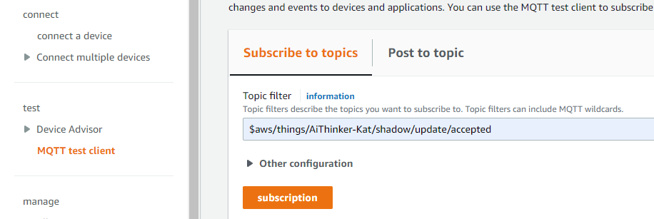
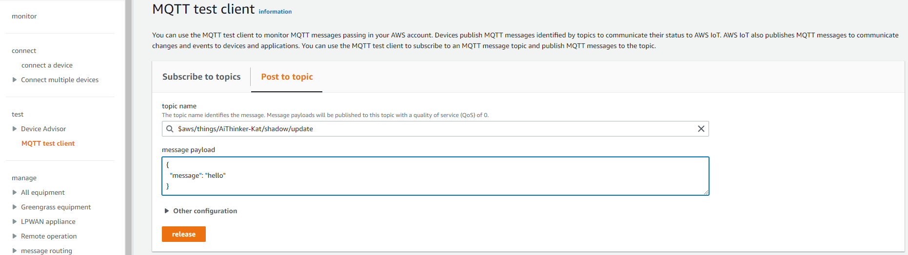

# aws iot Example
## Configure

Please configure the ssid and password that need to be connected to WiFi in advance,in main.c.
```c
#define ROUTER_SSID "your ssid"
#define ROUTER_PWD "your password"
```

According to the AWS IoT Development Guide, the developer shall obtain:

`xxx.cert.pem`

`xxx.private.key`

`AmazonRootCA1.pem`

`xxx-ats.iot.us-east-2.amazonaws.com(endpoint)`


Download the above certificate to replace the certificate and host in aws_test_cert.h

3.Subscribe
Subscribe to the topic "$aws/things/AiThinker-Kat/shadow/update" in the MQTT test client. 



4.Publish
Publish to the topic "$aws/things/AiThinker-Kat/shadow/update/accepted" in the MQTT test client. 



## Example Output
```c
(other log)...
[WF][SM] Exiting wifiConnected_ipObtaining state
[WF][SM] State Action ###wifiConnected_ipObtaining### --->>> ###wifiConnected_IPOK###
[WF][SM] Entering wifiConnected_IPOK state
[APP] [EVT] GOT IP 5949
[SYS] Memory left is 155496 Bytes

AWS IoT SDK Version 3.0.1-
                          Connecting...
DEBUG Seeding the random number generator...
DEBUG Loading embedded CA root certificate ...
DEBUG ok (0 skipped)
DEBUG Loading embedded client certificate...
DEBUG Loading embedded client private key...
DEBUG ok
DEBUG Connecting to a1r0zs8txbyccm-ats.iot.us-west-2.amazonaws.com/443...
-----------------> AABA Request:
    A-MSDU: Permitted
    Block Ack Policy: Immediate Block Ack
    TID: 0
    Number of Buffers: 64
-----------------> AABA Response:
    A-MSDU: Not Permitted
    Block Ack Policy: Immediate Block Ack
    TID: 0
    Number of Buffers: 8
    ssn: 0
    timeout: 1
    tid 0
DEBUG ok
DEBUG Setting up the SSL/TLS structure...
DEBUG SSL state connect : 0 
DEBUG ok
DEBUG SSL state connect : 0 
DEBUG Performing the SSL/TLS handshake...
DEBUG Verify requested for (Depth 2):
DEBUG cert. version     : 3
                           serial number     : 06:6C:9F:CF:99:BF:8C:0A:39:E2:F0:78:8A:43:E6:96:36:5B:CA
                                                                                                       issuer name       : C=US, O=Amazon, CN=Amazon Root CA 1
    subject name      : C=US, O=Amazon, CN=Amazon Root CA 1
                                                           issued  on        : 2015-05-26 00:00:00
                                                                                                  exp
DEBUG   This certificate has no flags
DEBUG Verify requested for (Depth 1):
DEBUG cert. version     : 3
                           serial number     : 06:7F:94:57:85:87:E8:AC:77:DE:B2:53:32:5B:BC:99:8B:56:0D
                                                                                                       issuer name       : C=US, O=Amazon, CN=Amazon Root CA 1
    subject name      : C=US, O=Amazon, OU=Server CA 1B, CN=Amazon
                                                                  issued  on        : 2015-10-22 00:00
DEBUG   This certificate has no flags
DEBUG Verify requested for (Depth 0):
DEBUG cert. version     : 3
                           serial number     : 03:26:78:7E:14:AE:12:15:7E:D1:48:79:D9:4F:C6:C5
                                                                                              issuer name       : C=US, O=Amazon, OU=Server CA 1B, CN=Amazon
  subject name      : CN=*.iot.us-west-2.amazonaws.com
                                                      issued  on        : 2022-05-16 00:00:00
                                                                                             expires 
DEBUG   This certificate has no flags
DEBUG ok [ Protocol is TLSv1.2 ]    [ Ciphersuite is TLS-ECDHE-RSA-WITH-AES-128-GCM-SHA256 ]
DEBUG  [ Record expansion is 29 ]
DEBUG Verifying peer X.509 certificate...
DEBUG ok
Connect ok!!!, start Subscribing Topic=[$aws/things/AiThinker-Kat/shadow/update/accepted]...
```

## Troubleshooting

For any technical queries, please open an [issue](https://github.com/Ai-Thinker-Open/Ai-Thinker-WB2/issues) on GitHub. We will get back to you soon.