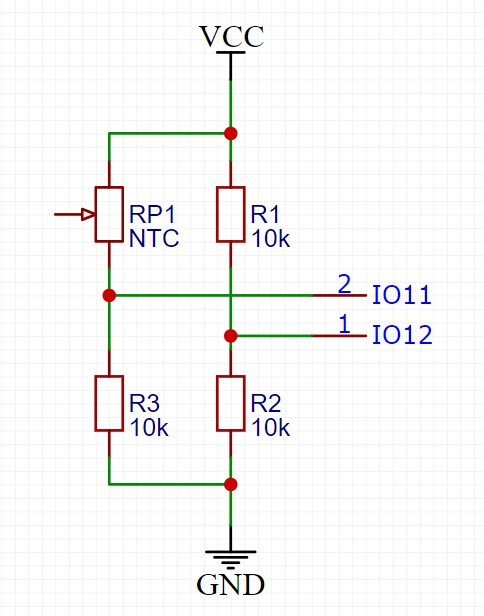
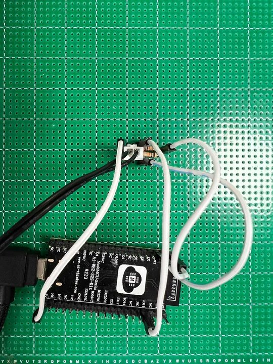
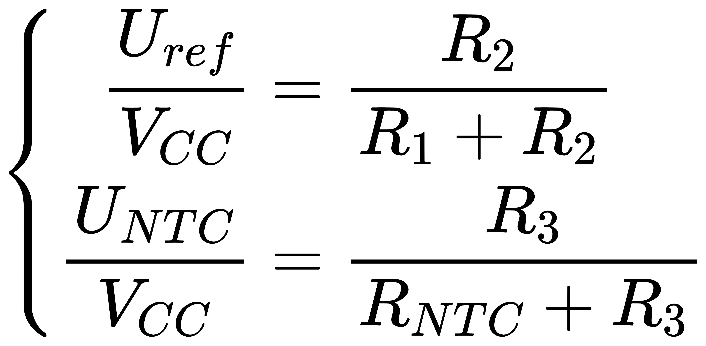
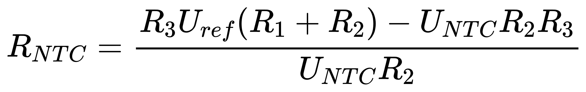
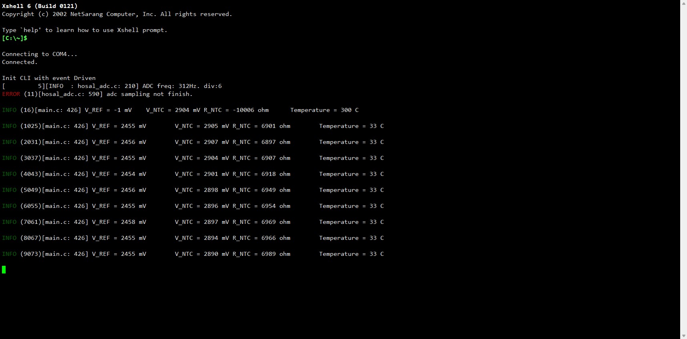

# Example: Ai-WB2 Series SoC Module Temperature Measurement via NTC

## Hardware Setup and Wiring





## Solve NTC Resistor Value






## Relationship between Resistor Value & Temperature

See [RT.csv](img/RT.csv)

## Build and Flash

```shell
make -j
make flash
```

## Run


