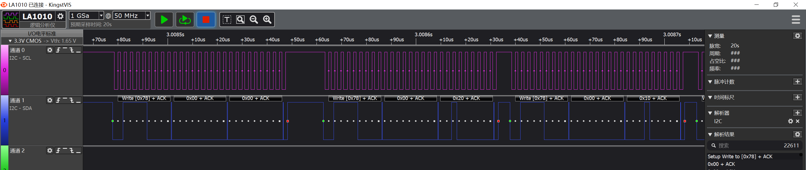

# Example: Ai-WB2 Series SoC Module output to the screen SSD1306 via I²C Bus

## Hardware Setup and Wiring

| Ai-WB2 Series SoC Module Pinout | SSD1306 |
|---|---|
| IO12 | SCL |
| IO3 | SDA |
| 3V3 | VCC |
| GND | GND |

## Build and Flash

```shell
make -j8
make flash
```

## Run


## Logic Analyzer Output


Please see the file logic_analyzer.kvdat for details.