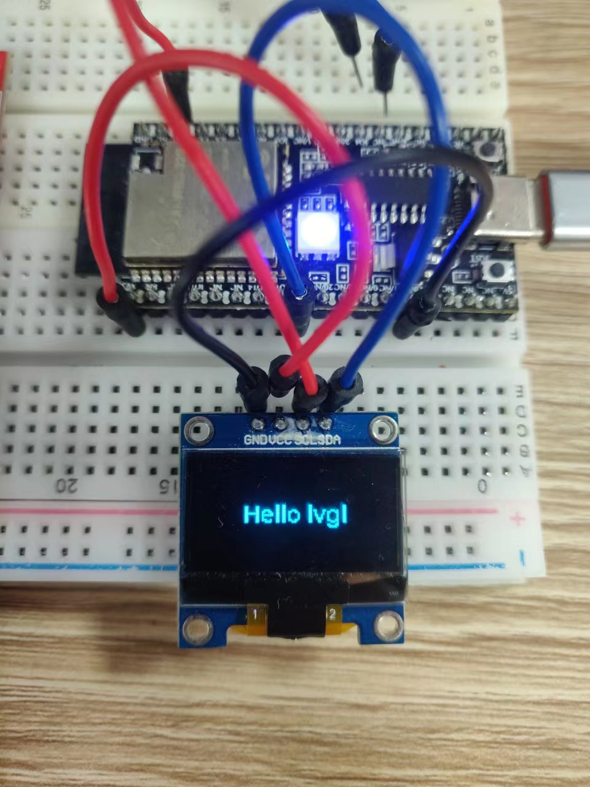

# LVGL Example

The display driver used in this routine is SSD1306,and the size is `128 * 64`.I2C communication mode。
## LVGL config
LVGL configuration is unified in the `lv_conf.h` file. You can configure the model, size and drive pin of the display,
### Model configuration
```c
#define LV_DISPLAY_SSD1306
```
### I2C pin configuration
```c
#define OLED_IIC_SCL 12
#define OLED_IIC_SDA 3
```
### Display direction configuration
```c
#define LV_DISPLAY_ORIENTATION_LANDSCAPE 
  // #define LV_DISPLAY_ORIENTATION_LANDSCAPE_INVERTED 
```
- LV_DISPLAY_ORIENTATION_LANDSCAPE:Normal display
- LV_DISPLAY_ORIENTATION_LANDSCAPE_INVERTED: Mirror Display

### Display screen size configuration
```c
#define MY_DISP_HOR_RES    128
#define MY_DISP_VER_RES    64
#define LV_VER_RES_MAX     10
```
## Run



## Troubleshooting

For any technical queries, please open an [issue](https://github.com/Ai-Thinker-Open/Ai-Thinker-WB2/issues) on GitHub. We will get back to you soon.