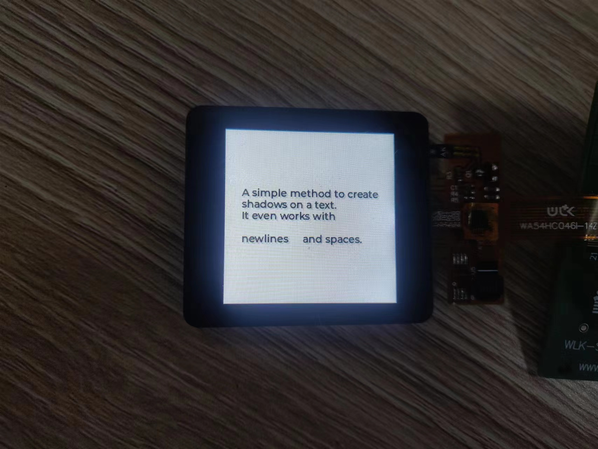
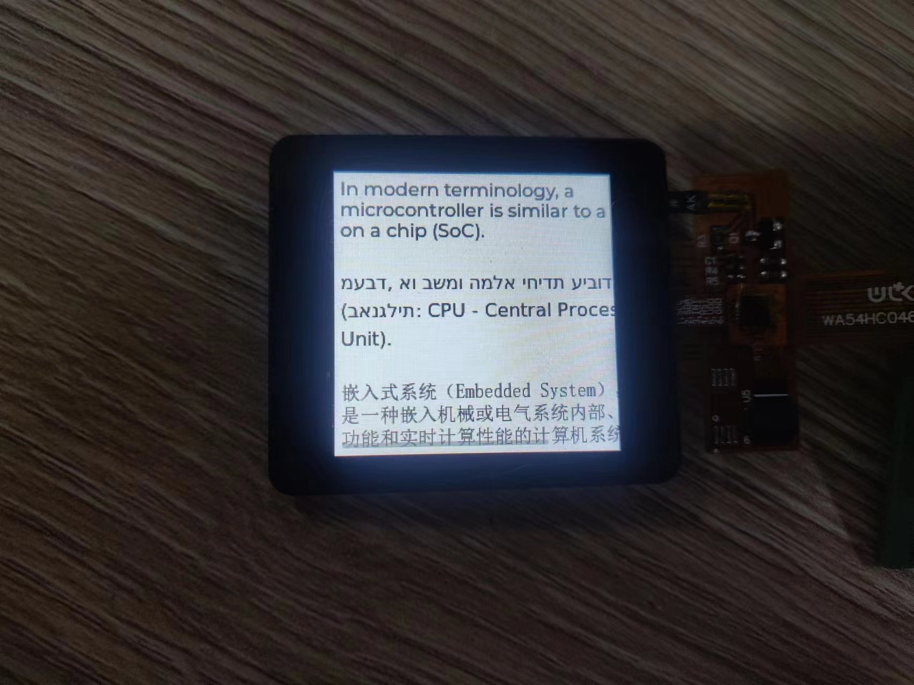
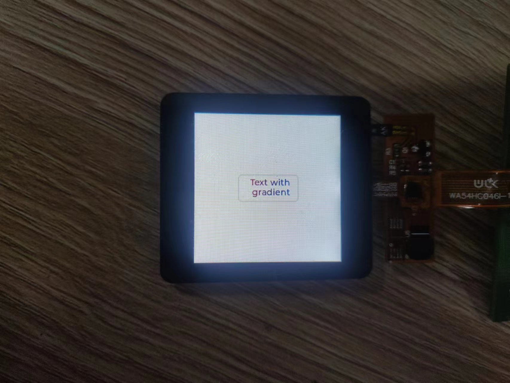

# LVGL Label Example
The screen used in this routine is a 240 * 240 TFT display screen driven by ST7789。

## LVGL config
LVGL configuration is unified in the `lv_conf.h` file. You can configure the model, size and drive pin of the display,
### Model configuration
```c
#define LV_DISPLAY_ST7789
```
### SPI pin configuration
```c

#define ST7789_DC 4
#define ST7789_CS 5
#define ST7789_RST 14
#define ST7789_CLK 3
#define ST7789_MOSI 12
#define ST7789_MISO 17
```
### Display direction configuration
```c
#define CONFIG_LV_DISPLAY_ORIENTATION 1
```
>CONFIG_ LV_ DISPLAY_ ORIENTATION can be configured as 0 to 3, respectively identifying four display directions

### Display screen size configuration
```c
#define LV_HOR_RES_MAX 240
#define LV_VER_RES_MAX 240
#define MY_DISP_VER_RES LV_VER_RES_MAX
#define MY_DISP_HOR_RES LV_HOR_RES_MAX
```
## Run
### example 1


### example 2


### example 3


### example 4



## Troubleshooting

For any technical queries, please open an [issue](https://github.com/Ai-Thinker-Open/Ai-Thinker-WB2/issues) on GitHub. We will get back to you soon.
