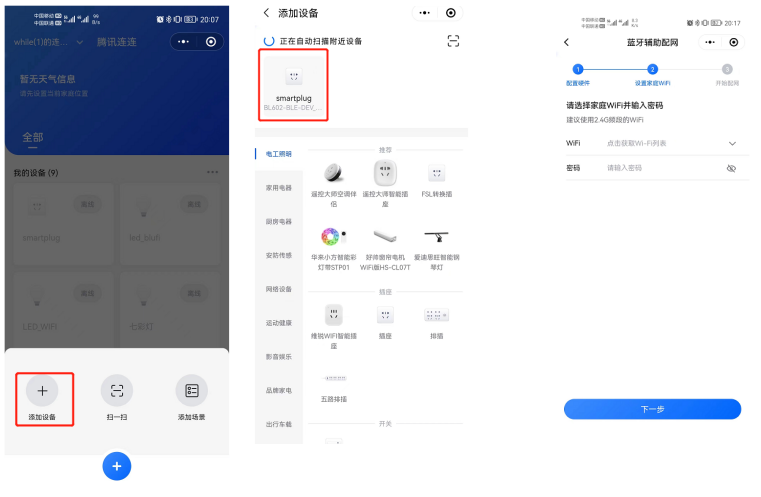

# 腾讯连连例程

## 硬件连接

设备连接云端后，通过KEY可控制LED亮灭，并上报属性到云端

LED------------------->GPIO14

KEY------------------->GPIO8

重新配网-------------->GPIO4

进入配网模式LED闪烁

## 设备创建

公共实例--->新建项目--->新建产品(标准品类、智慧生活、电工照明、灯)--->设置配网方式(softAP或标准BLE辅助)--->设备调试（新建设备）

## 设备配网方式设置

设备支持softAP、LLSync蓝牙辅助配网（主推蓝牙辅助配网）。默认配网方式为LLSync蓝牙辅助配网，切换配网方式需要修改下面的宏定义：
```
#define WIFI_PROV_SOFT_AP_ENABLE         0  ///< wifi provisioning method: device AP, need Wechat Applets
#define WIFI_PROV_SMART_CONFIG_ENABLE    0  ///< wifi provisioning method: smart config, need Wechat Applets
#define WIFI_PROV_AIRKISS_CONFIG_ENABLE  0  ///< wifi provisioning method: airkiss, need Wechat Applets
#define WIFI_PROV_SIMPLE_CONFIG_ENABLE   0  ///< wifi provisioning method: simple config, need Wechat Applets
#define WIFI_PROV_BT_COMBO_CONFIG_ENABLE 1  ///< wifi provisioning method: bt combo config, need Wechat Applets
```
## 三元组修改

用户需要在云平台找到设备对应的三元组，替换/qcloud_demo/components/qcloud_iot_c_sdk/platform/HAL_Device_freertos.c里的三元组
sg_product_id : product Id
sg_device_name : device name
sg_product_secret : product secret for device dynamic Registration
sg_device_secret：device secret


## 补丁

sofeAP配网需要在4网段，需要使用git apply在bl_iot_sdk打补丁dhcp_server_ip.patch

## 配网

腾讯连连小程序蓝牙配网流程：
进入腾讯连连小程序，进入“添加设备”，在添加设备界面小程序会自动扫描附近的设备，扫描到之后点击进入配网界面，按照提示完成配网即可。


## Troubleshooting

For any technical queries, please open an [issue](https://github.com/Ai-Thinker-Open/Ai-Thinker-WB2/issues) on GitHub. We will get back to you soon.