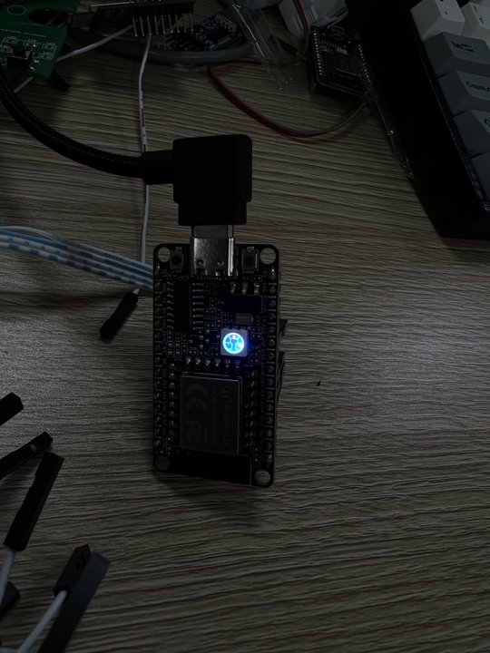
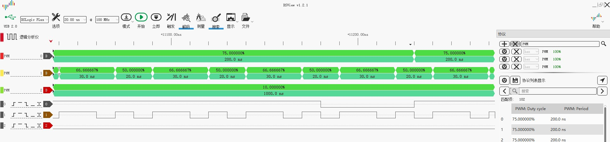

# Example: Ai-WB2 Series SoC Module Hardware PWM Module Output

## Hardware Setup and Wiring

| Ai-WB2 Series SoC Module Pinout | LED Pinout |
|---|---|
| IO14 | Red |
| IO17 | Green |
| IO3 | Blue |
| 3V3 | VCC |
| GND | GND |

## Build and Flash

```shell
make -j
make flash
```

## Run



## Logic Analyzer Output

See [data.csv](img/data.csv) for complete output.


