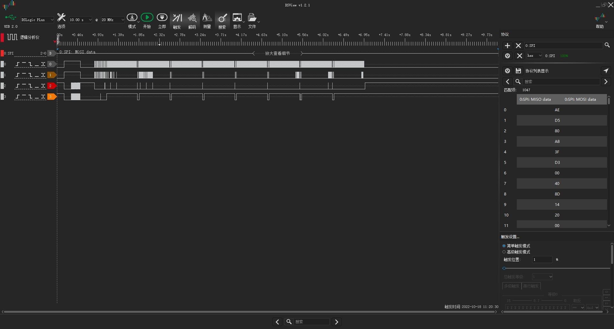

# Example: Ai-WB2 Series SoC Module Drives SSD1306 Monochrome 128x64 Resolution OLED Display via SPI

## Hardware Setup and Wiring

| Ai-WB2 Series SoC Module Pinout | OLED Display Pinout |
|---|---|
| IO4 | CS |
| IO5 | DC |
| EN/NC | RST |
| IO12 | DI |
| IO3 | CLK |
| 3V3 | VCC |
| GND | GND |

## Build and Flash

```shell
make -j
make flash
```

## Run


## Logic Analyzer Output

See [data.csv](img/data.csv) for complete output.


