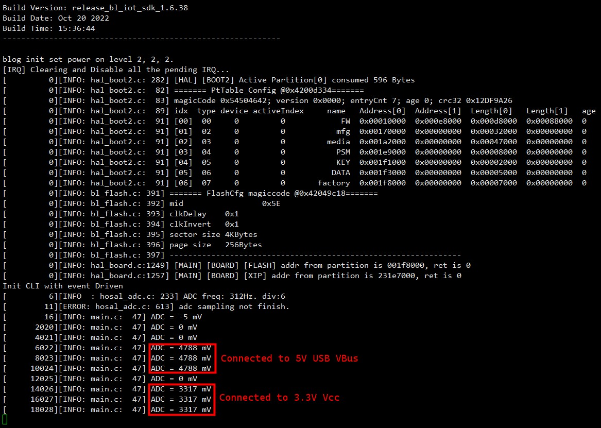

# Example: Ai-WB2 Series SoC Module ADC usage

## Hardware Setup and Wiring

| Ai-WB2 Series SoC Module Pinout | Peripheral Pinout |
|---|---|
| ADC | Voltage Probe (i.e. 3.3V or 5V VCC pinout) |
| 3V3 | VCC |
| GND | GND |

## Build and Flash

```shell
make -j
make flash
```

## Run


