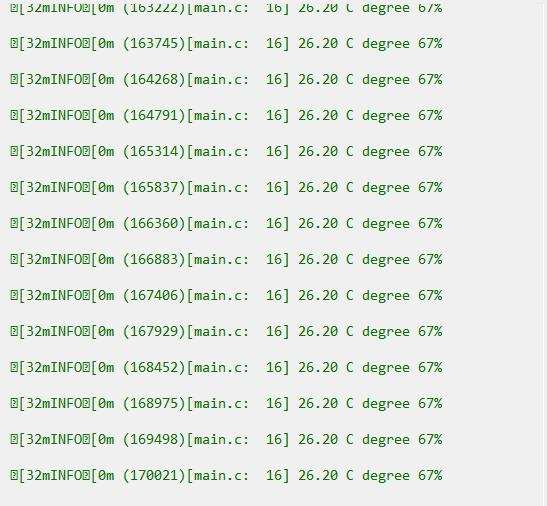
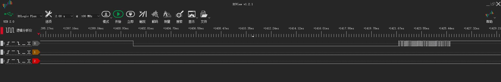

# Example: Ai-WB2 Series SoC Module Reads DHT11 Sensor via GPIO

## Hardware Setup and Wiring

| Ai-WB2 Series SoC Module Pinout | DHT11 Pinout |
|---|---|
| IO4 | DATA |
| 3V3 | VCC |
| GND | GND |

## Build and Flash

```shell
make -j
make flash
```

## Run



## Logic Analyzer Output


