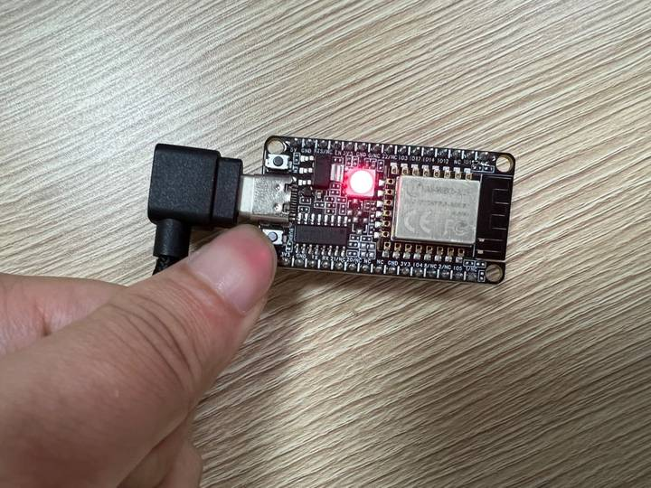

# Example: Ai-WB2 Series SoC Module GPIO usage

## Hardware Setup and Wiring

| Ai-WB2 Series SoC Module Pinout | Peripheral Pinout |
|---|---|
| IO14 | LED |
| IO8 | Button |
| 3V3 | VCC |
| GND | GND |

## Build and Flash

```shell
make -j
make flash
```

## Run


