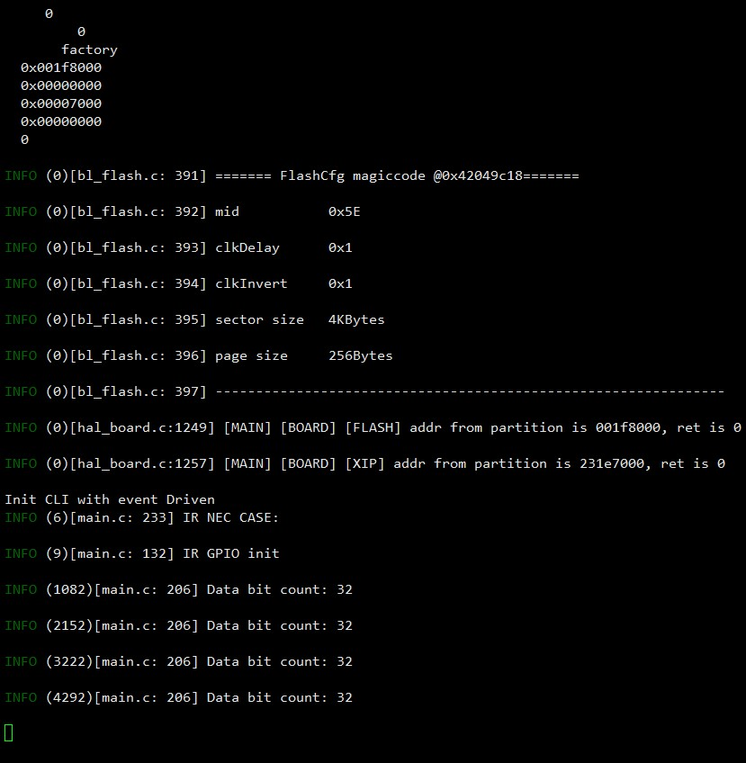
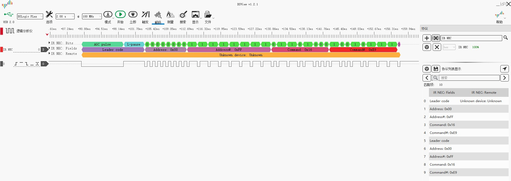

# Example: Ai-WB2 Series SoC Module IR Receive & Transmit

## Hardware Setup and Wiring

| Ai-WB2 Series SoC Module Pinout | Connect to |
|---|---|
| IO12 | IR Receiver Output |
| IO11 | Cathode of IR LED |
| VCC | Anode of IR LED |
| VCC | IR Receiver Vcc |
| GND | IR Receiver GND |


## Build and Flash

```shell
make -j
make flash
```

## Run



## Logic Analyzer Output


