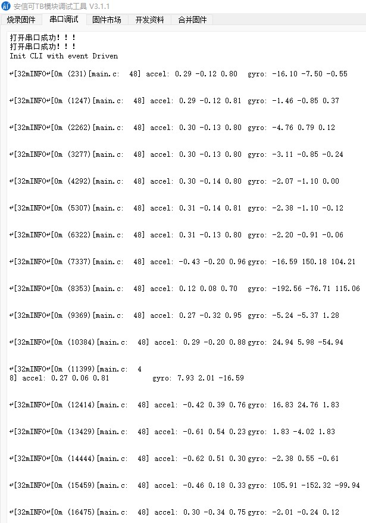
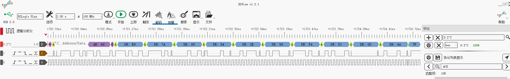

# Example: Ai-WB2 Series SoC Module Reads MPU6050 Sensor via I²C Bus

## Hardware Setup and Wiring

| Ai-WB2 Series SoC Module Pinout | MPU6050 Pinout |
|---|---|
| IO4 | SCL |
| IO5 | SDA |
| 3V3 | VCC |
| GND | GND |

## Build and Flash

```shell
make -j
make flash
```

## Run



## Logic Analyzer Output


