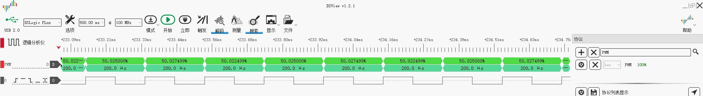

# Example: Ai-WB2 Series SoC Module Timer Sample

## Hardware Setup and Wiring

| Ai-WB2 Series SoC Module Pinout | Connect to |
|---|---|
| IO3 | Probe |

## Build and Flash

```shell
make -j
make flash
```

## Logic Analyzer Output


