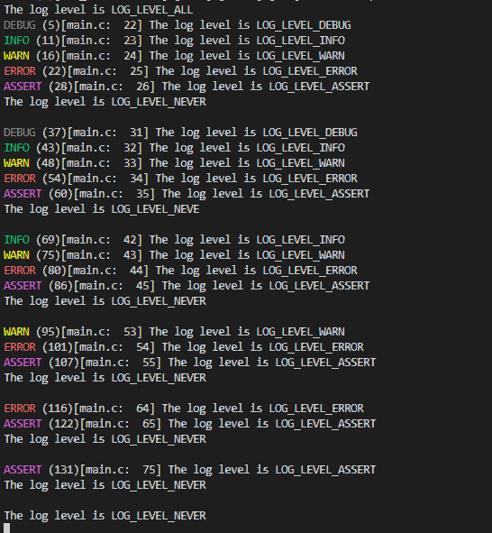

# blog_demo world Example
The SDK has the following levels in total:
```c
typedef enum _blog_leve {
    BLOG_LEVEL_ALL = 0,
    BLOG_LEVEL_DEBUG,
    BLOG_LEVEL_INFO,
    BLOG_LEVEL_WARN,
    BLOG_LEVEL_ERROR,
    BLOG_LEVEL_ASSERT,
    BLOG_LEVEL_NEVER,
} blog_level_t;
```
> In which, DEBUG level does not print by default, even if it has been set to DEBUG level, there will be no output
> You can start the output of DEBUG level through the macro definition in "blog_cfg. h"

```c
#define BLOG_POWERON_SOFTLEVEL_FILE         (BLOG_LEVEL_INFO) //BLOG_LEVEL_INFO ---> BLOG_LEVEL_DEBUG
```
This routine enables DEBUG level to demonstrate DEBUG output.
## Example Output
```shell
Booting Ai-WB2 Modules...
------------------------------------------------------------
RISC-V Core Feature:RV32-ACFIMX
Build Version: release_bl_iot_sdk_1.6.38
Build Date: Oct 22 2022
Build Time: 16:07:11
------------------------------------------------------------

blog init set power on level 2, 1, 2.
[IRQ] Clearing and Disable all the pending IRQ...
INFO (0)[hal_boot2.c: 285] [HAL] [BOOT2] Active Partition[0] consumed 596 Bytes
INFO (0)[hal_boot2.c:  82] ======= PtTable_Config @0x4200d158=======
INFO (0)[hal_boot2.c:  83] magicCode 0x54504642; version 0x0000; entryCnt 7; age 0; crc32 0x12DF9A26
INFO (0)[hal_boot2.c:  91] idx  type device activeIndex     name   Address[0]  Address[1]  Length[0]   Length[1]   age
INFO (0)[hal_boot2.c:  93] [00]  00     0         0            FW  0x00010000  0x000e8000  0x000d8000  0x00088000  0
INFO (0)[hal_boot2.c:  93] [01]  02     0         0           mfg  0x00170000  0x00000000  0x00032000  0x00000000  0
INFO (0)[hal_boot2.c:  93] [02]  03     0         0         media  0x001a2000  0x00000000  0x00047000  0x00000000  0
INFO (0)[hal_boot2.c:  93] [03]  04     0         0           PSM  0x001e9000  0x00000000  0x00008000  0x00000000  0
INFO (0)[hal_boot2.c:  93] [04]  05     0         0           KEY  0x001f1000  0x00000000  0x00002000  0x00000000  0
INFO (0)[hal_boot2.c:  93] [05]  06     0         0          DATA  0x001f3000  0x00000000  0x00005000  0x00000000  0
INFO (0)[hal_boot2.c:  93] [06]  07     0         0       factory  0x001f8000  0x00000000  0x00007000  0x00000000  0
INFO (0)[bl_flash.c: 392] ======= FlashCfg magiccode @0x42049c18=======
INFO (0)[bl_flash.c: 393] mid           0x5E
INFO (0)[bl_flash.c: 394] clkDelay      0x1
INFO (0)[bl_flash.c: 395] clkInvert     0x1
INFO (0)[bl_flash.c: 396] sector size   4KBytes
INFO (0)[bl_flash.c: 397] page size     256Bytes
INFO (0)[bl_flash.c: 398] ---------------------------------------------------------------
INFO (0)[hal_board.c:1289] [MAIN] [BOARD] [FLASH] addr from partition is 001f8000, ret is 0
INFO (0)[hal_board.c:1297] [MAIN] [BOARD] [XIP] addr from partition is 231e7000, ret is 0
The log level is LOG_LEVEL_ALL
DEBUG (5)[main.c:  22] The log level is LOG_LEVEL_DEBUG
INFO (11)[main.c:  23] The log level is LOG_LEVEL_INFO
WARN (16)[main.c:  24] The log level is LOG_LEVEL_WARN
ERROR (22)[main.c:  25] The log level is LOG_LEVEL_ERROR
ASSERT (28)[main.c:  26] The log level is LOG_LEVEL_ASSERT
The log level is LOG_LEVEL_NEVER

DEBUG (37)[main.c:  31] The log level is LOG_LEVEL_DEBUG
INFO (43)[main.c:  32] The log level is LOG_LEVEL_INFO
WARN (48)[main.c:  33] The log level is LOG_LEVEL_WARN
ERROR (54)[main.c:  34] The log level is LOG_LEVEL_ERROR
ASSERT (60)[main.c:  35] The log level is LOG_LEVEL_ASSERT
The log level is LOG_LEVEL_NEVE

INFO (69)[main.c:  42] The log level is LOG_LEVEL_INFO
WARN (75)[main.c:  43] The log level is LOG_LEVEL_WARN
ERROR (80)[main.c:  44] The log level is LOG_LEVEL_ERROR
ASSERT (86)[main.c:  45] The log level is LOG_LEVEL_ASSERT
The log level is LOG_LEVEL_NEVER

WARN (95)[main.c:  53] The log level is LOG_LEVEL_WARN
ERROR (101)[main.c:  54] The log level is LOG_LEVEL_ERROR
ASSERT (107)[main.c:  55] The log level is LOG_LEVEL_ASSERT
The log level is LOG_LEVEL_NEVER

ERROR (116)[main.c:  64] The log level is LOG_LEVEL_ERROR
ASSERT (122)[main.c:  65] The log level is LOG_LEVEL_ASSERT
The log level is LOG_LEVEL_NEVER

ASSERT (131)[main.c:  75] The log level is LOG_LEVEL_ASSERT
The log level is LOG_LEVEL_NEVER

The log level is LOG_LEVEL_NEVER
```

## Troubleshooting

For any technical queries, please open an [issue](https://github.com/Ai-Thinker-Open/Ai-Thinker-WB2/issues) on GitHub. We will get back to you soon.