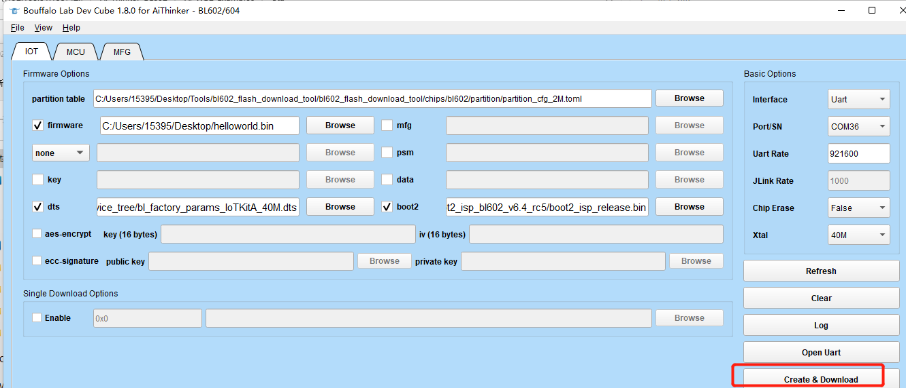
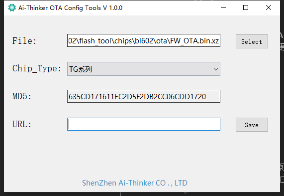

# OTA Example

## create ota firmware

1. open the bl602_flash_download_tool
2.  Select the firmware you want to OTA
3.  click the Create&Download button
4. The ota firmware will be created in \chips\bl602\ota directory, Select FW_OTA.bin (compressed upgrade) or fw_ota.bin.xz (dual-partition upgrade)



5. Add header information to ota firmware

open Ai-Thinker OTA Config Tools.exe(in tools directory) and Select FW_OTA.bin or fw_ota.bin.xz



## Configure
Please configure the ssid and password that need to be connected to WiFi in advance,in main.c

```c
#define ROUTER_SSID "your ssid"
#define ROUTER_PWD "your password"
```
Then configure the url for ota firmware
```c
#define url "https://chencong--test.oss-cn-beijing.aliyuncs.com/test.bin"
```
## Example Output
```c
(other log)...
[WF][SM] Exiting wifiConnected_ipObtaining state
[WF][SM] State Action ###wifiConnected_ipObtaining### --->>> ###wifiConnected_IPOK###
[WF][SM] Entering wifiConnected_IPOK state
[APP] [EVT] GOT IP 6008
[SYS] Memory left is 154816 Bytes
[OTA] port:443 host:chencong--test.oss-cn-beijing.aliyuncs.com path:/test.bin
mbedtls_entropy_init
mbedtls_ctr_drbg_seed success
mbedtls_ssl_setup sucess
-----------------> AABA Request:
    A-MSDU: Permitted
    Block Ack Policy: Immediate Block Ack
    TID: 0
    Number of Buffers: 64
-----------------> AABA Response:
    A-MSDU: Not Permitted
    Block Ack Policy: Immediate Block Ack
    TID: 0
    Number of Buffers: 8
    ssn: 0
    timeout: 1
    tid 0
mbedtls_net_connect sucess
mbedtls_ssl_handshake sucess
SSL ciphersuite TLS-ECDHE-RSA-WITH-AES-128-GCM-SHA256
                                                     mbedtls_ssl_write success

Download new firmware begin, total size : 72169
                                               MBEDTLS_SSL_MAX_CONTENT_LEN = 16384
head_len = 480 writelen=544 index = 1024
version = 1.0.0
chip_type = 0004
http head md5:3BE39B7C06476F5534A8B7E0DEDCDEFF
[MTD] >>>>>> Hanlde info Dump >>>>>>
      name FW
      id 0
      offset 0x000e8000(950272)
      size 0x00088000(544Kbytes)
      xip_addr 0x00000000
[MTD] <<<<<< Hanlde info End <<<<<<
[OTA] activeID:0 
init_ota_partition success, ota_addr:0xe8000, part_size:0x88000 
[OTA] erase start_addr:0x0 size:0x12000 
[OTA] write dst_offset:0x4316 
[OTA] write dst_offset:0x84b6 
[OTA] write dst_offset:0xc656 
[OTA] write dst_offset:0x107f6 


end

MD5 verify success
3BE39B7C06476F5534A8B7E0DEDCDEFF
[OTA] ota size:0x11940 
OTA Success
Booting Ai-WB2 Modules...

```
## Troubleshooting

For any technical queries, please open an [issue](https://github.com/Ai-Thinker-Open/Ai-Thinker-WB2/issues) on GitHub. We will get back to you soon.