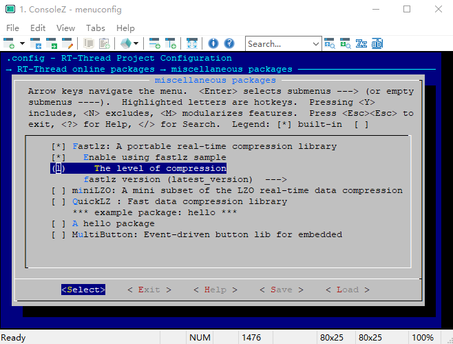

# FastLZ

[中文页](README_ZH.md) | English

## 1 Introduction

FastLZ is a fast and lossless compression library that contains only two files, is simple to use and easy to integrate. This [FastLZ](https://github.com/RT-Thread-packages/fastlz) library is a port of RT-thread to the official [FastLZ](http://fastlz.org/download.htm) C library. For more information about fastlz, please refer to [http://fastlz.org/index.html](http://fastlz.org/index.html).

## 2. How to obtain

- Use menuconfig
```
  RT-Thread online packages --->
      miscellaneous packages --->
          [*] Fastlz: A portable real-time compression library
```

## 3. Example introduction

### 3.1 Get examples

- Configure the enable sample option `Enable using fastlz sample`;
- Configure the compression level option, set to level 1 (there are two levels 1 or 2, level 1 has the fastest compression speed, and level 2 has a large compression ratio);
- The configuration package version is selected as the latest version `latest_version`.



### 3.2 Run example
This example is a simple file compression and decompression routine, which depends on the file system. The commands used are two `-c` and `-d`. The `-c` command compresses one file to another, ` The -d` command decompresses a file to another file.
How to use:
msh cmd compression: `fastlz_test -c /file.bin /file.cmprs.bin`
msh cmd decompression: `fastlz_test -d /file.cmprs.bin /file_dcmprs.bin`

```
msh />fastlz_test -c /file.bin /file.cmprs.bin
[fastlz]compress start: >>>>>>>>>>>>>>>>>>>>>>>>>>>>>>>>>>>>>>>>>>>> >>>>>>>>>>>>>>>>>>>>>>>>>>>>
[fastlz]compressed 469848 bytes into 363495 bytes, compression ratio is 77%!
msh />
msh />fastlz_test -d /file.cmprs.bin /file_dcmprs.bin
[fastlz]decompress start: >>>>>>>>>>>>>>>>>>>>>>>>>>>>>>>>>>>>>>>>>>>> >>>>>>>>>>>>>>>>>>>>>>>>>>>>
[fastlz]decompressed 363495 bytes into 469848 bytes!
```

## 4. Matters needing attention

### 4.1 Differences from the official source code

  The FastLZ source code uses static memory allocation. A 32Kbytes buffer is preset, which occupies too much stack resources. The source code is modified and dynamic memory allocation is used to replace the original static memory allocation.

  Make the following changes to the source code `fastlz.c`, you need to pay attention when porting the official code:

  1. Add dynamic memory allocation definition
  ```C
#include <rtthread.h>

#define malloc rt_malloc
#define free rt_free
  ```

  2. Use `malloc` to allocate memory for `htab`
  ```C
const flzuint8* htab[HASH_SIZE];
  ```
Replace with
  ```C
const flzuint8** htab = (const flzuint8**)malloc(sizeof(flzuint8*) * HASH_SIZE);
  ```

  3. Use `free` to release memory before `return`

## 5. Reference materials

- FastLZ official website: [http://fastlz.org/index.html](http://fastlz.org/support.htm)
